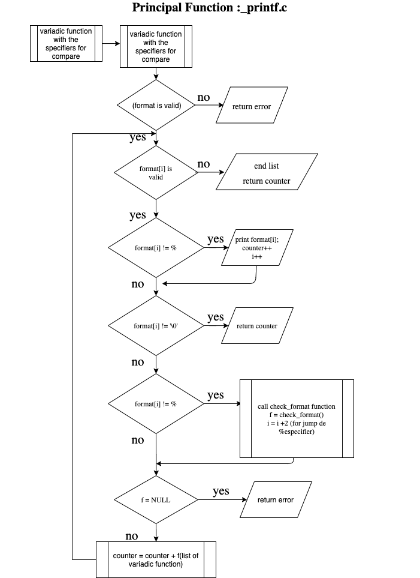

# holbertonschool-printf

# HolbertonSchool-printf

a project by azza guesmi.

## Authors

- [@azzaguesmi00](https://www.github.com/azzaguesmi00)

## Description
"_printf" is a function that produces an output according to format

A brief description of what this project does and who it's for

 d, i   The int argument is converted to signed decimal notation.
              The precision, if any, gives the minimum number of digits
              that must appear; if the converted value requires fewer
              digits, it is padded on the left with zeros.  The default
              precision is 1.  When 0 is printed with an explicit
              precision 0, the output is empty.

c      If no l modifier is present, the int argument is converted
              to an unsigned char, and the resulting character is
              written.  If an l modifier is present, the wint_t (wide
              character) argument is converted to a multibyte sequence
              by a call to the wcrtomb(3) function, with a conversion
              state starting in the initial state, and the resulting
              multibyte string is written. 

   s      If no l modifier is present: the const char * argument is
              expected to be a pointer to an array of character type
              (pointer to a string).  Characters from the array are
              written up to (but not including) a terminating null byte
              ('\0'); if a precision is specified, no more than the
              number specified are written.  If a precision is given, no
              null byte need be present; if the precision is not
              specified, or is greater than the size of the array, the
              array must contain a terminating null byte.

The unsigned int argument is converted to unsigned octal
              (o), unsigned decimal (u),  value
              requires fewer digits, it is padded on the left with
              zeros.  The default precision is 1.  When 0 is printed
              with an explicit precision 0, the output is empty.

## Flowchart 

